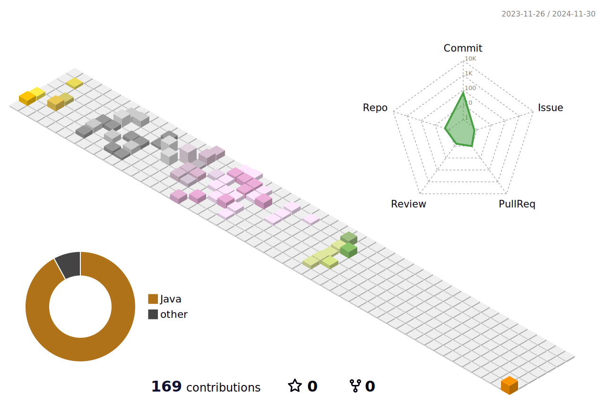

#  Hola! Mi nombre es Beatriz

**Desarrolladora de Aplicaciones Web y Multiplataforma** 💻 

Tras construir mi carrera profesional en el mundo Tech como Senior Key Account Manager IT, decidí
en los últimos años adentrarme profundamente en mi pasíon por la programacón y por expandir mi creatividad.
Desde que abrí esa puerta, cada reto ha sido una emocionante aventura!
Especialmente interesada en el desarrollo de software, VR, AR e IA.  

## Contacto

## ⚡ Tecnologías más usadas

### 🚀 Lenguajes

### 🧩 Librerías & Frameworks 

### 📘 Otras...

## 📈 Trabajando en...

